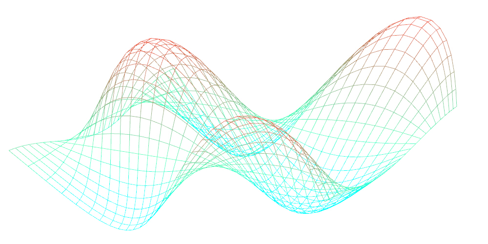
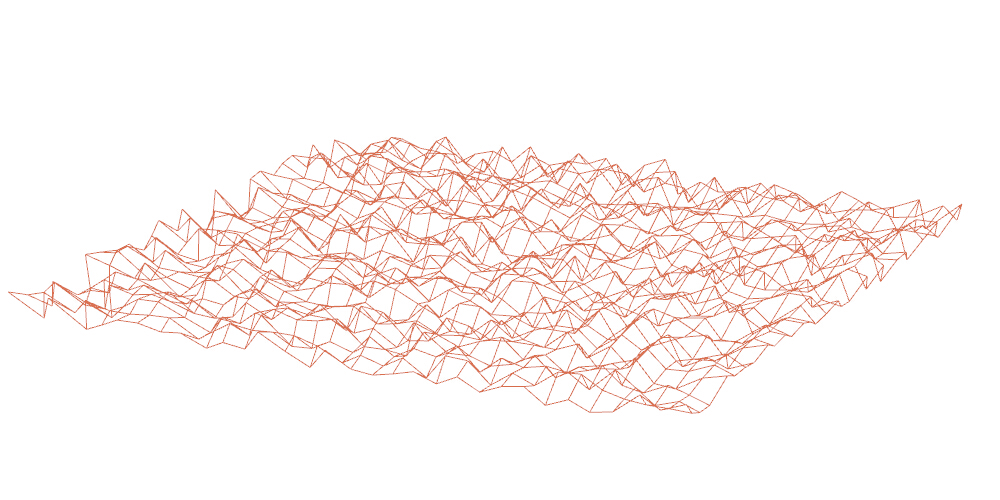
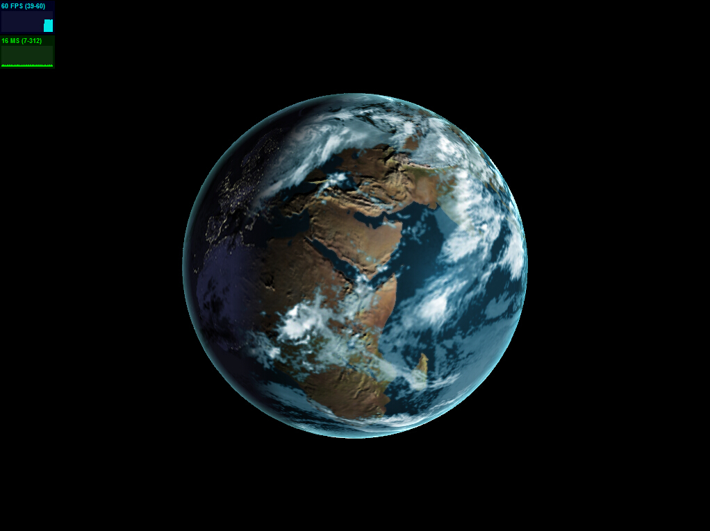
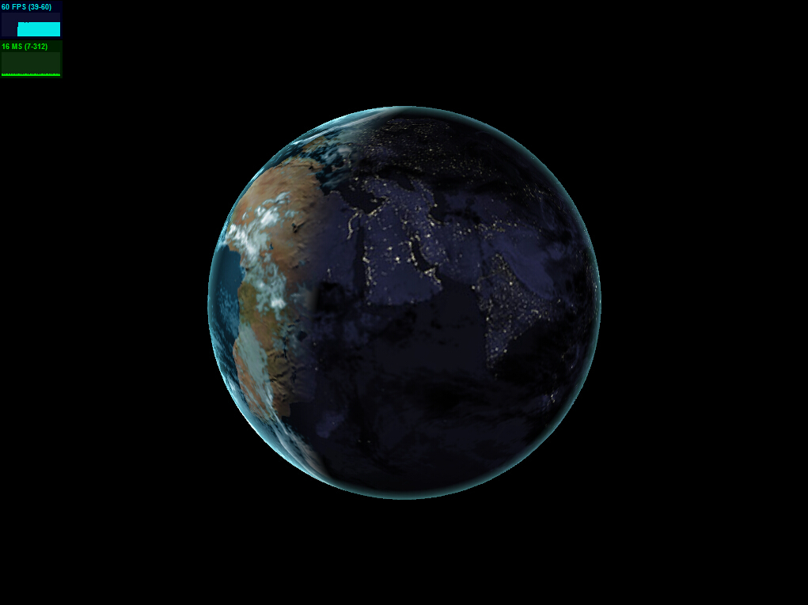
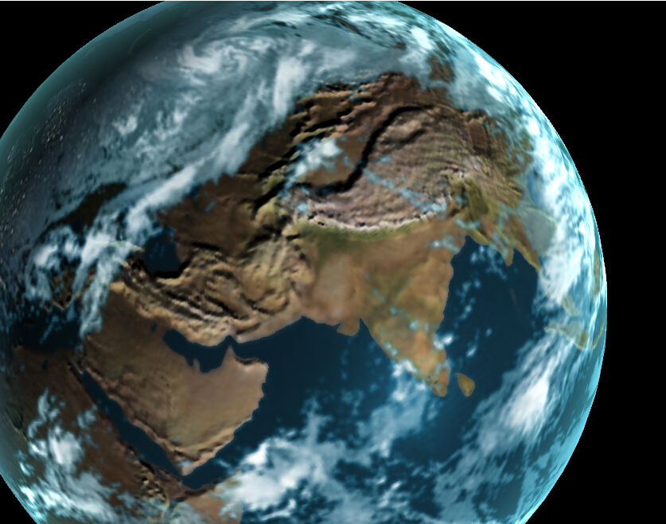
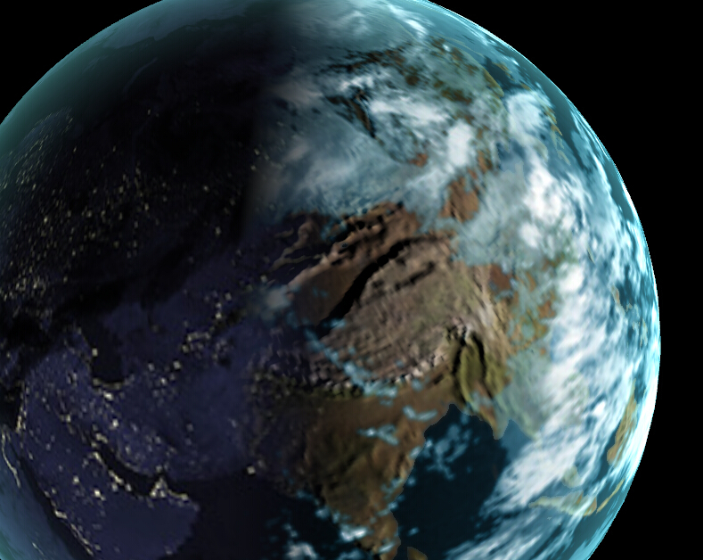
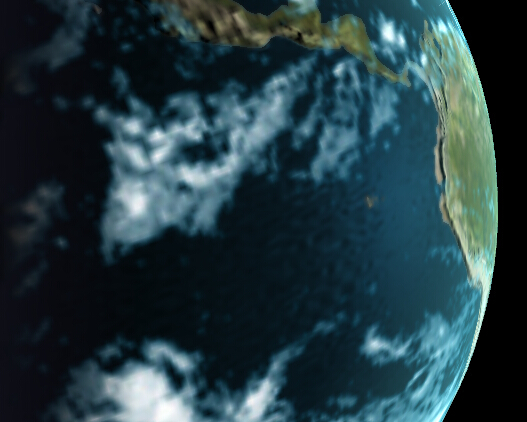

-------------------------------------------------------------------------------
CIS565: Project 5: WebGL
-------------------------------------------------------------------------------
Jiawei Wang

WebGL Demos
-------------
part1:

 - [sin-shape](http://wang1262.github.io/Project5-WebGL/vert_wave.html)
  - Basic shape from sin and cos wave

 - [earthquake-custom_shape](http://wang1262.github.io/Project5-WebGL/index_custom.html)
  - Using random function to generate values from position, add u_time value to the height make it move, frequency is high so it looks like earthquake.

part2:

 - [globe](http://wang1262.github.io/Project5-WebGL/globe/frag_globe.html)
  - Implemented Night Lights, Specular Map, Clouds, Bump Map, Rim Lighting. Also add water rendering by using the noise function. (reference #1).
  -  Add stas.js to monitor the performace. (reference #2)

Performance
------------
By monitoring the FPS of the webgl pages, it is always around 60 FPS. When we use mouse to enlarge the earth globe or change the window size of the web page, the FPS will goes down some number around 50 and back to 60 very quickly.

Reference
------------
 - 1: [Stefan Gustavson's paper "Simplex noise demystified"](http://www.itn.liu.se/~stegu/simplexnoise/simplexnoise.pdf)

 - 2: [JavaScript Performance Monitor](https://github.com/mrdoob/stats.js/)

